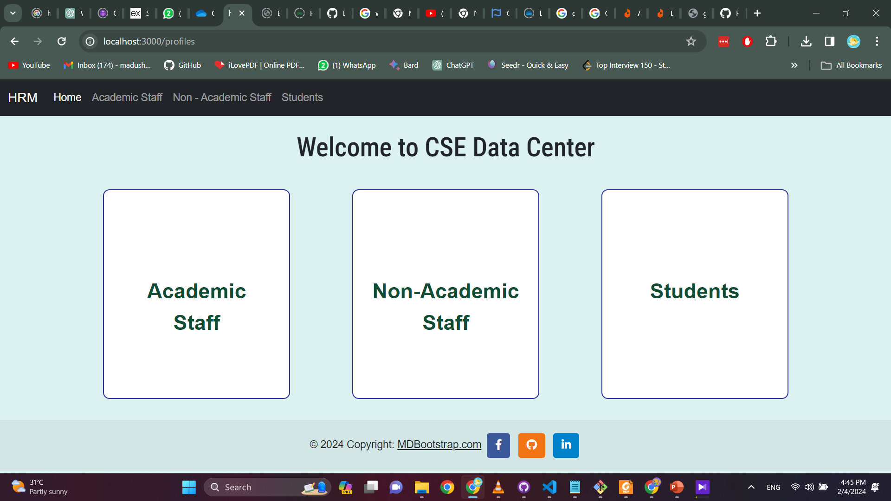
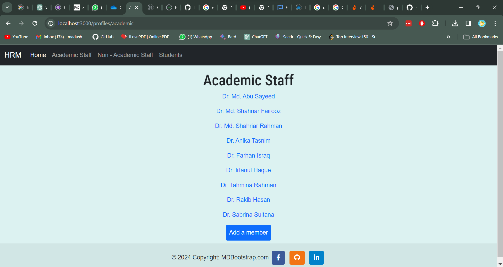
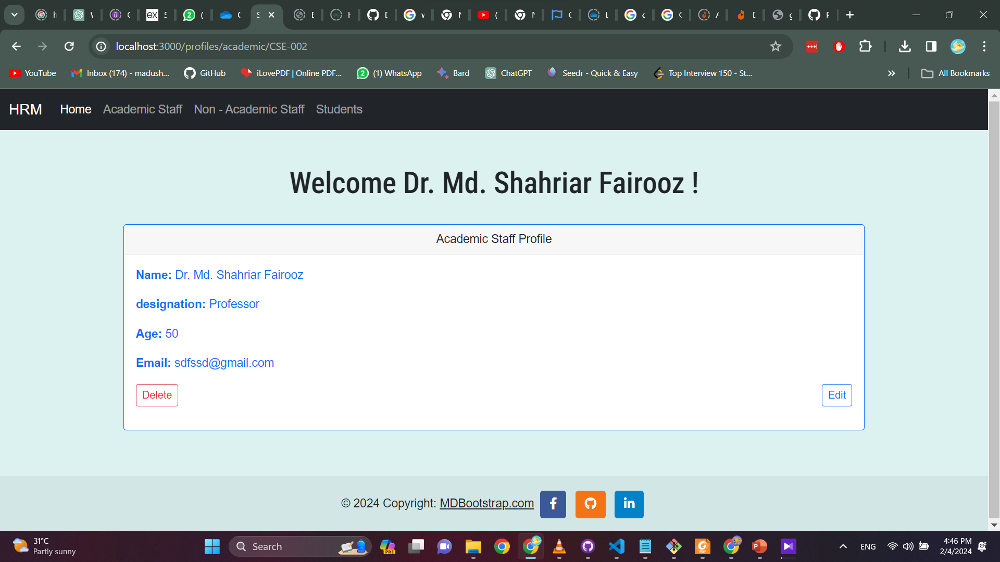
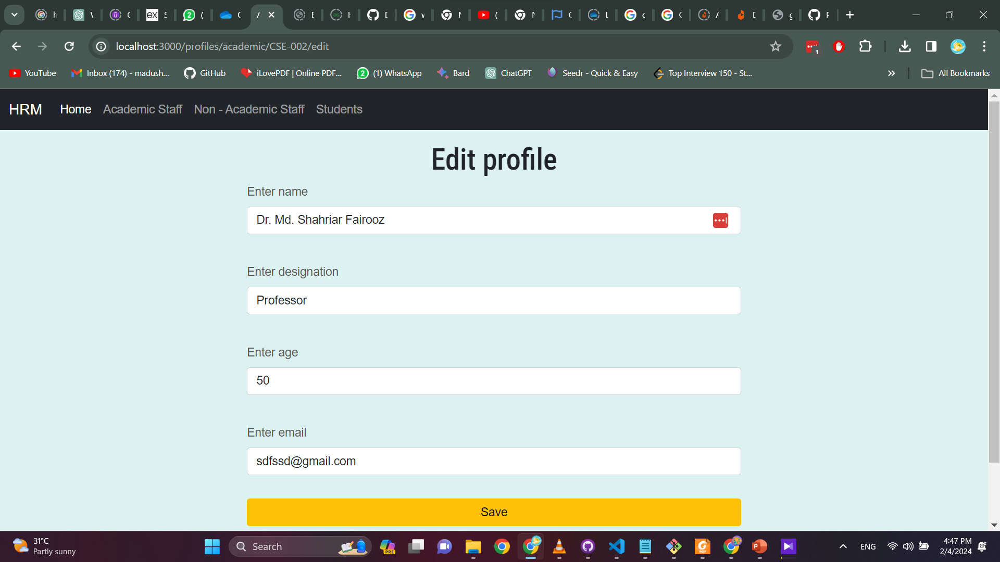
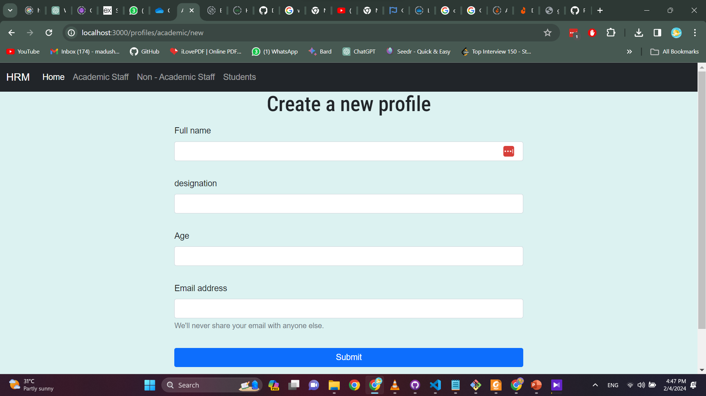

# CSE Data Center - CRUD Operations Practice

## Overview

CSE Data Center is a web application designed to manage and display profile details of the Computer Science and Engineering (CSE) department's staff and students. This project is built using Express.js to practice Create, Read, Update, and Delete (CRUD) operations.

## Features

- **List Profiles**: View a list of all profiles categorized under Academic Staff, Non-Academic Staff, and Students.
- **Add Profiles**: Add new profiles to any category with details such as name, designation, age, and email.
- **View Individual Profile**: Access detailed information about each staff or student.
- **Edit Profiles**: Update existing information of any profile in the database.
- **Delete Profiles**: Remove profiles from the database when necessary.

## Installation

To get the application running locally on your system:

1. Ensure that you have Node.js and npm installed.
2. Clone the repository to your local machine.
3. Navigate to the project directory and install dependencies with `npm install`.
4. Start the application using `npm start`. It will be accessible on `localhost:3000`.

## Usage

After starting the application, you can perform the following operations:

- **View Profiles**: Navigate to the appropriate category from the home page.
- **Add a Profile**: Click on 'Add a member' in the category you choose.
- **Edit a Profile**: Click on an individual's name and select 'Edit'.
- **Delete a Profile**: On the individual's profile page, click 'Delete'.

## Edit Profile

To edit a profile, navigate to the individual's profile page and click 'Edit'. You will be redirected to a form where you can update the name, designation, age, and email of the profile.

## Adding a New Profile

To add a new profile, click on the 'Add a member' button from the main category page. Fill in the details in the form and submit.

## Tech Stack

- **Frontend**: EJS templates
- **Backend**: Node.js with Express.js
- **Database**: JSON files simulating a database
- **Styling**: Bootstrap for responsive design

## Contributing

Contributions to improve the application are welcome. Please ensure to update tests as appropriate.

