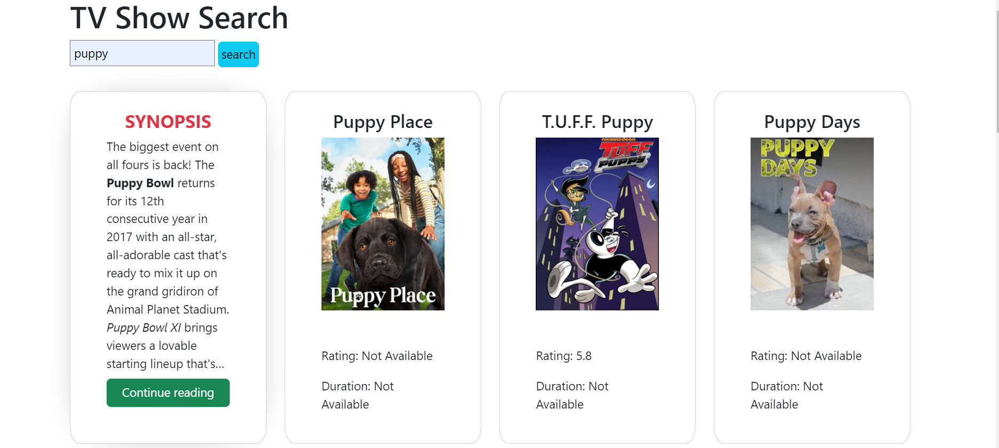

# TV Show Search

TV Show Search is a web application that allows users to search for TV show information using the TVMaze API. It provides details such as show summaries, ratings, and images, and offers a dynamic user interface.

## Features

- Search for TV shows using the TVMaze API.
- View ratings and images related to the TV shows.
- Responsive design that works on desktops, tablets, and mobile phones.

## Technology Stack

- HTML
- CSS
- JavaScript
- Axios for API requests
- Bootstrap for responsive design

## Setup

To get this project up and running on your local machine, follow these steps:

1. Clone this repository to your local machine using `git clone`.
2. Ensure you have `npm` installed on your system.
3. Navigate to the project directory and run `npm install` to install dependencies.
4. Open the `index.html` file in your web browser.

## Usage

To use the application:

1. Enter a search term in the search bar.
2. Click on the 'search' button to retrieve TV show information.
3. Scroll through the search results displayed on the page.
4. Hover over a card to see more details on the back of the card.

## API Reference

The application uses the TVMaze API for fetching TV show data. The documentation for the TVMaze API can be found at [TVMaze API Documentation](https://www.tvmaze.com/api).

## Contributing

Contributions to this project are welcome. Please follow these steps to contribute:

1. Fork the repository.
2. Create a new branch for your feature (`git checkout -b feature/fooBar`).
3. Commit your changes (`git commit -am 'Add some fooBar'`).
4. Push to the branch (`git push origin feature/fooBar`).
5. Create a new Pull Request.

## License

This project is licensed under the MIT License - see the LICENSE.md file for details.

## Acknowledgments

- TVMaze API for providing an extensive database of TV show information.
- Bootstrap team for their excellent framework that made the responsive design possible.
